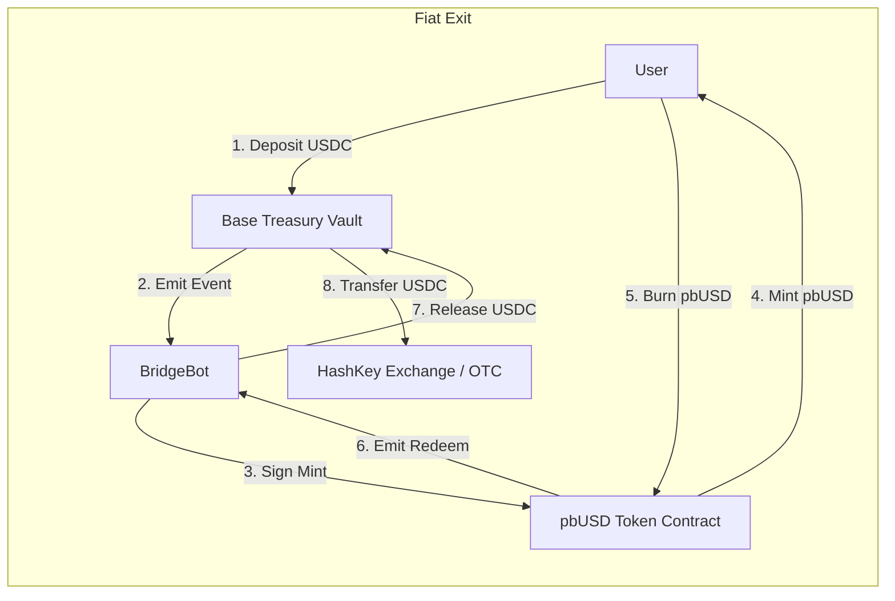

# HashKey Chain Integration & pbUSD System

## 1. Overview
Protocol Bank supports **HashKey Chain (HSK)** as a specialized liquidity layer for RWA (Real World Asset) settlement and large-scale fiat exits. While Base and Arbitrum utilize standard stablecoins (USDC/USDT) for corporate batch payments, HashKey is utilized primarily for **Compliance-First Fiat Off-ramping**.

| Feature | Details |
| :--- | :--- |
| **Chain ID** | `177` (Mainnet) / `133` (Testnet) |
| **Native Token** | `HSK` |
| **Primary Use Case** | RWA Settlement, Exchange Deposits, Fiat Withdrawals |
| **Stablecoin Model** | **pbUSD** (Synthetic, 1:1 backed by Base USDC) |

---

## 2. The pbUSD Stablecoin System

### 2.1 Problem & Solution
HashKey Chain currently lacks native liquidity for major stablecoins (USDC/USDT). To solve this without relying on fragmented third-party bridges, Protocol Bank implements **pbUSD (Protocol Bank USD)**.

*   **Type**: Synthetic Stablecoin (Mint-and-Burn).
*   **Backing**: 100% backed by USDC held in the **Protocol Bank Treasury** on Base Chain.
*   **Peg**: 1 pbUSD = 1 USDC.

### 2.2 System Architecture

### 2.3 Smart Contract Specifications

#### A. ProtocolBankUSD (HashKey Chain)
The user-facing token on HashKey.
*   **Standard**: ERC20 + Permit + AccessControl.
*   **Features**:
    *   `Pausable`: Emergency freeze of all transfers.
    *   `Blacklist`: Regulatory compliance to block sanctioned addresses.
    *   `mint()`: Protected by `MINTER_ROLE` (Bridge Bot).
    *   `burnAndRedeem()`: User initiates exit to Base.

#### B. ProtocolBankTreasury (Base Chain)
The vault holding the collateral.
*   **Asset**: Native USDC (`0x8335...`).
*   **Features**:
    *   `depositToHashKey()`: User locks USDC to bridge.
    *   `releaseFromBurn()`: Bridge Bot releases USDC upon verified pbUSD burn.
    *   `RELAYER_ROLE`: Only authorized bots can trigger releases.

---

## 3. Integration & Usage

### 3.1 For Developers

**Contract Addresses (Mainnet)**
*   **pbUSD (HashKey)**: `0x...` (Pending Deployment)
*   **Treasury (Base)**: `0x...` (Pending Deployment)

**Bridge Controller**
The off-chain worker (see `scripts/pbusd-controller.js`) monitors both chains:
*   Listens for `DepositedToHashKey` on Base -> Mints on HashKey.
*   Listens for `RedeemRequested` on HashKey -> Releases on Base.

### 3.2 Feature Flags (Frontend)
The frontend (`app/(products)/batch-payment/page.tsx`) explicitly **blocks** batch payments on HashKey to guide users toward the correct use case:

> "Corporate batch transfers are not available on HashKey Chain... HashKey Chain is currently optimized for RWA and large fiat withdrawals only using pbUSD."

### 3.3 Security & Compliance
1.  **Access Control**: Minter/Relayer roles are separated from Admin.
2.  **Emergency Pause**: In case of bridge compromise, `pbUSD` transfers can be paused globally.
3.  **Blacklist**: Malicious actors can be frozen at the contract level to comply with RWA regulations.

---

## 4. Deployment Strategy

1.  **Phase 1 (Testnet)**:
    *   Deploy Treasury to Base Sepolia.
    *   Deploy pbUSD to HashKey Testnet.
    *   Run `pbusd-controller.js` locally.
2.  **Phase 2 (Audit)**: Internal review of `ProtocolBankTreasury.sol`.
3.  **Phase 3 (Mainnet)**:
    *   Deploy to Base Mainnet & HashKey Mainnet.
    *   Configure Oracle/Relayer with MPC wallet.
    *   Enable frontend RWA features.

---

## 5. Previous Documentation
*Replaces content from deprecated `PBUSD_DESIGN.md`.*
