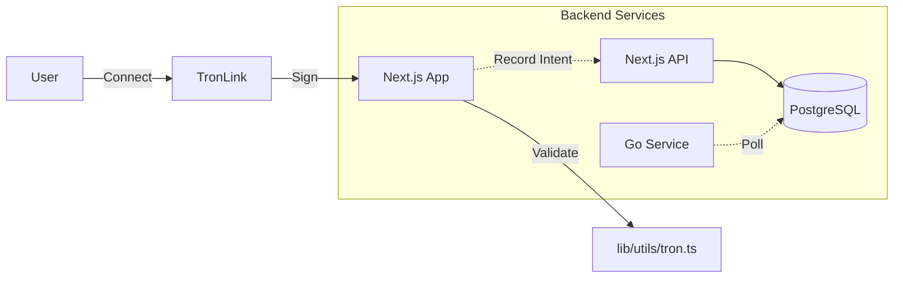

# Tron Network Integration

## 1. Overview
Protocol Bank interacts with the Tron network to support `TRC20` stablecoins (USDT) and native `TRX` transactions. The integration is hybrid, utilizing client-side wallets (TronLink) for user interactions and a Go-based backend service for automated payouts.

**Current Status:** 🟡 Partial Implementation
- ✅ Wallet Connection (TronLink)
- ✅ Address Validation
- ⚠️ Transaction Execution (Frontend logic missing)
- ⚠️ Backend Payouts (Currently Mocked)

---

## 2. Architecture

### 2.1 detailed Architecture Components
1.  **Frontend (Next.js)**
    *   **Library**: `tronweb` (^6.2.0)
    *   **Function**: Manages connection to browser extensions (TronLink). Responsible for signing and broadcasting user-initiated transactions.
    *   **Logic**: Located in `lib/utils/tron.ts` and `components/wallet-provider.tsx`.

2.  **Payout Engine (Microservice)**
    *   **Language**: Go
    *   **Library**: `github.com/fbsobreira/gotron-sdk`
    *   **Function**: Intended to handle batch payouts and server-side transfers.
    *   **Current State**: The `processTronJob` function in `pkg/processor/tron.go` is currently a placeholder that returns mocked transaction hashes.

3.  **Data Layer**
    *   **Storage**: Transactions are stored in the shared `Payment` table in PostgreSQL.
    *   **Validation**: Addresses are validated using regex `^T[a-zA-Z0-9]{33}$` before storage.

### 2.2 Data Flow

---

## 3. Key Features

| Feature | Status | Implementation Details |
| :--- | :--- | :--- |
| **Wallet Connection** | ✅ Active | Connects via `window.tronWeb`. Supports account switching. |
| **Address Validation** | ✅ Active | Validates Base58check addresses using `TronWeb.isAddress`. |
| **Payment Recording** | ✅ Active | Database schema supports non-EVM address formats. |
| **USDT Transfer** | ❌ Pending | Frontend `sendPayment` logic only supports EVM (viem/ethers). |
| **Batch Payouts** | ⚠️ Mocked | Backend service returns `"fake_tron_tx_hash_..."`. |

---

## 4. Technical Debt & TODOs

### 4.1 Critical Issues
- **Missing Frontend Send Logic**: 
  - File: `lib/services/payment-service.ts`
  - Issue: The `sendTransaction` function throws an error if a non-EVM address is detected. Needs a specific branch for `if (isTronAddress)`.
  
- **Mocked Backend Execution**:
  - File: `payout-engine/internal/service/sender.go`
  - Issue: The actual broadcasting of transactions is commented out or replaced with a mock return.

### 4.2 Security Gaps
- **Private Key Management**:
  - File: `payout-engine/internal/config/config.go`
  - Issue: Contains `TODO: Get private key from secure storage`. Currently relies on empty environment variables or placeholders.

### 4.3 Refactoring Needed
- **Type Definitions**: `window.tronWeb` is currently typed as `any` in several places. Needs a proper TypeScript interface.
